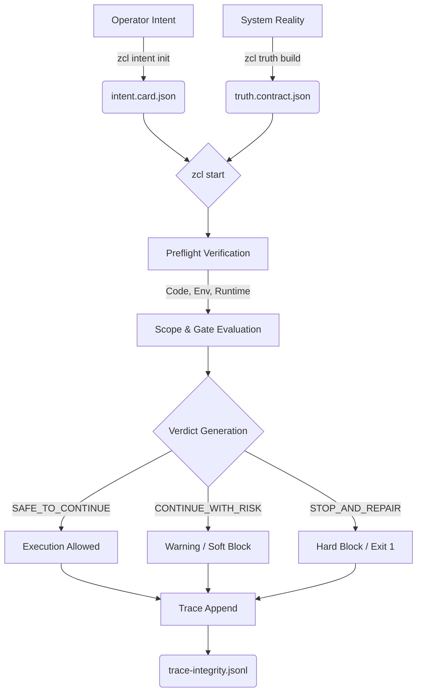

# Data Flow & Execution Model — Z-MOS Gen4 v0.4.0 "Gen4 Controlled Trial"

Z-MOS Gen4 v0.4.0 "Gen4 Controlled Trial" implements a **Truth-First, Fail-Closed** architecture. Execution is gated by a deterministic verification pipeline that evaluates the system's operational reality against the operator's intent before allowing protected actions.

---

## End-to-End Execution Flow

The standard execution lifecycle follows a sequential verification model.



### 1. Intent Declaration (`intent.card.json`)
The operator declares what they intend to do, what files they will touch (`scope_files`), and what conditions require stopping. This establishes the boundary of the task.

### 2. Truth Establishment (`truth.contract.json`)
The system captures an atomic snapshot of the current reality: git commit, branch, environment identity, and schema hashes. This represents the **Canonical Runtime Authority**.

### 3. Preflight & Verification (`zcl start` / `zcl preflight`)
The system compares the reality (`truth.contract`) against the intent (`intent.card`) and the global policies (`zmos-manifest.json`). 
- **Drift Detection**: Has the environment changed since the truth contract was built?
- **Scope Guard**: Are the requested `scope_files` allowed by the project's mutation policy?
- **Gate Evaluation**: Are all required checks (e.g., `schema-validate`) passing?

### 4. Verdict & Enforcement
Based on the verification, a verdict is reached:
- `SAFE_TO_CONTINUE`: Execution proceeds.
- `STOP_AND_REPAIR`: A critical drift or policy violation occurred. The system **fails closed** (exit 1).

### 5. Trace Logging (`trace-integrity.jsonl`)
Regardless of the outcome (success or block), the system writes an append-only, SHA-256 hashed record to the trace log. This ensures non-repudiation and audibility of all governance decisions.

---

## Fail-Closed Model

Z-MOS operates on a strict fail-closed paradigm. If the system encounters an unknown state, missing evidence, or contradictory facts, it denies execution.

- **Missing Truth Contract**: BLOCK
- **Invalid Schema**: BLOCK
- **Commit/Environment Drift**: BLOCK (Escalates to `CRITICAL_DRIFT_HARD_BLOCK`)
- **Empty Scope Allow-list (Strict Mode)**: BLOCK

There is no "bypass" flag. Recovery requires explicit repair (e.g., reverting changes or rebuilding the truth contract via `zcl truth build` to establish a new baseline).

---

## The Sequential Verification Rule

Verification commands must be run **sequentially**, not in parallel. 

```bash
# Correct (Sequential)
zcl schema validate && zcl truth build && zcl preflight && zcl start

# Incorrect (Parallel)
zcl schema validate & zcl truth build & zcl preflight
```

**Reasoning**: Certain verification steps (like truth building or trace validation) perform atomic file operations with temporary backups. Parallel execution can cause race conditions leading to false positives (false RED states) in integrity checks.

---

## Authority Resolution

When resolving conflicts, the system respects the following hierarchy:

1. **Global Manifest** (`zmos-manifest.json`): Defines the ultimate boundaries (e.g., protected paths that can never be touched).
2. **Runtime Truth** (`truth.contract.json`): Dictates whether the current environment is stable enough to operate in.
3. **Execution Intent** (`intent.card.json`): Defines the specific boundaries for the *current task*, which must fit within the Global Manifest limits.
4. **Legacy Compatibility** (`handoff/latest.json`): Transitional artifact, strictly non-authoritative. Cannot override the Truth Contract.
