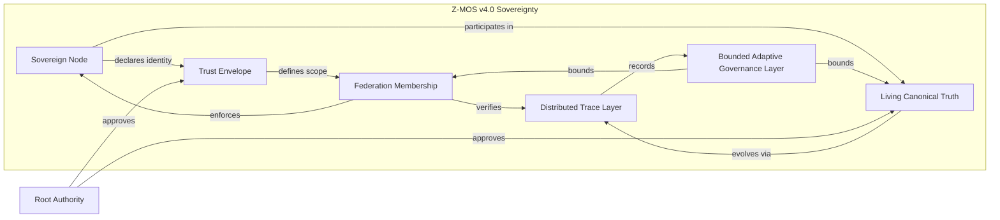

# Sovereignty Architecture Integration View

- Document Code: `ADD-GEN4-006`
- Version: `0.1`
- Status: Draft
- Basis: RD-GEN4-001 v0.3, ADD-GEN4-001 v0.2, ADD-GEN4-002 v0.2, ADD-GEN4-003 v0.2, ADD-GEN4-004 v0.1, ADD-GEN4-005 v0.1

---

## 1. Architecture Purpose

The Sovereignty Architecture Integration View defines the Phase 0 architecture for Z-MOS v4.0 "Sovereignty" as a Distributed Sovereign Governance Runtime. It is not merely a CLI or a single-node runtime. It is a governance surface that connects Sovereign Nodes, Trust Envelopes, Living Truth Transitions, Federation Membership, and Distributed Trace.

---

## 2. Core Components

- **Sovereign Node**: The runtime participant that enforces canonical authority locally and participates in federation governance.
- **Root Authority**: The ultimate source of trust and authority in the system.
- **Trust Envelope**: The governance boundary contract that defines node permissions and trust scope.
- **Federation Runtime**: The coordinated environment in which nodes share governance contracts and state.
- **Living Canonical Truth**: The authoritative truth contract that evolves through controlled, signed transitions.
- **Federation Membership**: The explicit, auditable membership relationship for trusted federation participants.
- **Distributed Trace Layer**: The evidence layer that records governance actions across nodes.
- **Bounded Adaptive Governance Layer**: The governance layer that allows controlled adaptation within strict limits.

---

## 3. End-to-End Governance Flow

The integration view describes the governance flow from node onboarding to truth transition.

1. Node declares identity.
2. Trust Envelope is issued.
3. Federation membership is requested.
4. Membership is verified and activated.
5. Intent is authorized.
6. Truth transition is proposed.
7. Trace evidence is collected.
8. Authority approves or rejects.
9. Signed transition is propagated.
10. Distributed trace records the event chain.

This flow demonstrates how the core governance components cooperate.

---

## 4. Mermaid Architecture Diagram

---

## 5. Architecture Boundaries

- **Authority Boundary**: Root Authority and delegated authorities define explicit governance rights.
- **Node Boundary**: Each Sovereign Node owns its local state and enforces its trust boundary.
- **Federation Boundary**: Federation membership defines which nodes share governance trust relationships.
- **Trace Boundary**: The distributed trace layer records evidence without leaking hidden state.
- **Adaptive Governance Boundary**: Adaptive behaviors are bounded and cannot override hard-block invariants.

This integration view serves as a design reference only, not an implementation blueprint. It must not be interpreted as a schedule for runtime networking, distributed sync, or execution semantics. No networking/runtime sync should be inferred from the architecture diagram.

---

## 6. Phase 0 Completion Readiness

Phase 0 is ready for review when the following documents are complete:

- `RD-GEN4-001`
- `RD-GEN4-002`
- `ADD-GEN4-001`
- `ADD-GEN4-002`
- `ADD-GEN4-003`
- `ADD-GEN4-004`
- `ADD-GEN4-005`
- `ADD-GEN4-006`

---

## Notes

This integration view is architecture-focused and does not include implementation details. It is intended to close the Phase 0 governance surface before moving into design refinement.
