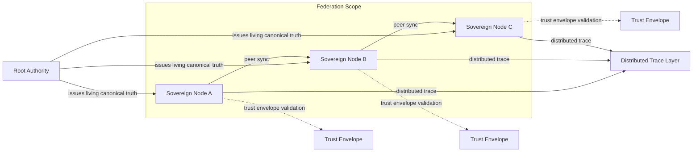

# Z-MOS Gen 4 Requirements Document (RD)

- Document Code: `RD-GEN4-001`
- Version: `0.2`
- Status: Draft
- Baseline: Z-MOS v3.0.1 "Purity"

---

## 1. Vision & Objectives

### 1.1 Proposed Codename

- **Z-MOS v4.0 "Sovereignty"**

### 1.2 Vision Statement

Z-MOS v4.0 "Sovereignty" is a distributed sovereign governance runtime that extends current Purity foundations into a federated architecture of trust-aware nodes. Gen 4 enables multiple sovereign nodes to maintain a consistent, auditable execution surface while preserving canonical authority, human-authorized intent, and fail-closed safety.

### 1.3 Living Canonical Truth

A Living Canonical Truth is the active, authoritative runtime contract that can safely evolve through explicit authority ownership and authenticated change rules. It is a controlled, versioned source of governance truth that remains the single source of authority across the federation, and it is never treated as an unconstrained mutable state store.

### 1.4 Objectives

1. **Establish distributed sovereign governance**
   - Enable federated runtime execution across cooperating nodes with shared canonical intent and truth.
   - Anchor governance decisions in authorized sovereign authorities rather than local ephemeral state.

2. **Define Living Truth evolution**
   - Build explicit rules for how canonical truth may change over time.
   - Ensure evolution is auditable, authorized, and bounded.

3. **Implement Authority Ownership**
   - Make authority ownership explicit and discoverable.
   - Support root authority, delegated authorities, and local sovereign nodes with verifiable trust envelopes.

4. **Enable bounded adaptive governance**
   - Allow policy and runtime decisions to adapt within defined guardrails.
   - Preserve hard-block semantics for unknown or unauthorized actions.

5. **Maintain Purity-grade auditability and recovery**
   - Keep trace integrity and recoverability as first-class requirements.
   - Improve operational usability without weakening canonical trust.

---

## 2. Core Principles

These principles extend Gen 3 Purity with Sovereignty requirements. Every design decision must obey these core rules.

### 2.1 Pure Truth-First Authority

- Canonical authority remains the source of truth for all governance decisions.
- Policy decisions must resolve from `.z-mos/truth.contract.json` or its federated equivalent.
- Legacy session artifacts and stale entrypoints must remain out of the enforcement path.

### 2.2 Living Truth Evolution Rules

- Canonical truth may evolve only under explicit authority ownership.
- Evolution requires authenticated intent, versioned contract transitions, and attested approval metadata.
- Runtime nodes must validate truth updates against a bounded evolution policy before accepting them.

### 2.3 Bound Adaptive Governance

- Governance can adapt to runtime evidence, but only inside pre-defined guardrails.
- Adaptive decisions are permitted when they preserve safety, intent boundaries, and trace accountability.
- Fail-closed behavior is enforced for any action outside the bounded governance envelope.

### 2.4 Authority Ownership

- Each sovereign authority must be explicit and discoverable.
- Root Authority defines the ultimate canonical contract, while delegated authorities may control subsets of truth, intent, or operational scope.
- Authority Ownership is encoded in trust metadata and validated during runtime negotiation.

### 2.5 Explicit Execution Intent

- Execution must always be bounded by an explicit, human-authorized intent card.
- Intent cards define allowed actions, tools, data access, termination conditions, and governance scope.
- Distributed execution requires intent acceptance across participating nodes.

### 2.6 Immutable Audit & Verification

- Execution traces must remain append-only and verifiable.
- The trace layer is a trust foundation, not a convenience log.
- Verification evidence should be integral to operations like `zcl start`, `zcl truth build`, `zcl sync`, and `zcl doctor`.

### 2.7 Separation of Engine and Project State

- Core engine logic remains stateless across nodes.
- Project-specific runtime memory remains isolated under `.z-mos/` on each node.
- Federated state coordination is explicit, not implicit.

### 2.8 Legacy Drift Elimination

- Legacy artifacts must not be reintroduced into the enforcement path.
- Repair flows must continue to sanitize stale references and seed current canonical paths.

---

## 3. Gap Analysis

This section compares the current Gen 3 Purity implementation with the Gen 4 "Sovereignty" target and highlights the highest-priority P0 gaps.

### 3.1 Priority P0: Federation + Authority Ownership

- Current state: Gen 3 Purity operates as a single-node workspace runtime with local `.z-mos/` state.
- Desired state: A federated runtime where sovereign nodes share trust metadata, canonical truth, and intent without sacrificing hard-block safety.
- P0 gap: No federation protocol, no explicit authority ownership model, and no federated trust envelope semantics exist today.

### 3.2 Architecture Gap

| Capability | Gen 3 Purity | Gen 4 Sovereignty | Gap |
|---|---|---|---|
| Runtime topology | Single workspace / single node | Federated sovereign nodes | High |
| Canonical trust distribution | Local canonical file | Shared living canonical truth | High |
| Node trust model | Local authority only | Authority ownership + trust envelope | High |

### 3.3 Governance Gap

| Capability | Gen 3 Purity | Gen 4 Sovereignty | Gap |
|---|---|---|---|
| Enforcement model | Static hard-block / fail-closed | Bounded adaptive governance | Medium |
| Policy evolution | Manual/offline updates | Authenticated living truth updates | High |
| Authority metadata | Implicit file ownership | Explicit ownership, delegation, trust envelopes | High |

### 3.4 Functional Gap

| Capability | Gen 3 Purity | Gen 4 Sovereignty | Gap |
|---|---|---|---|
| Runtime federation | None | Node discovery + federation scope | High |
| Intent sharing | Local intent card only | Federated intent acceptance | Medium |
| Trace correlation | Single-node JSONL | Distributed trace layer | High |

### 3.5 Operational Gap

| Capability | Gen 3 Purity | Gen 4 Sovereignty | Gap |
|---|---|---|---|
| Bootstrap | `zcl init`, `zcl memory init` | Federated bootstrap + authority onboarding | High |
| Recovery | Local repair commands | Cross-node recovery and canonical resync | High |
| Observability | Local diagnostics | Federated trust and trace visibility | Medium |

### 3.6 Gen 3 Strengths to Leverage

- Canonical authority files already exist: `.z-mos/truth.contract.json` and `.z-mos/intent.card.json`.
- Runtime artifact seeds and repair paths exist in `cli/commands/init.ts` and `cli/commands/memory.ts`.
- The current trace and verification model provides a strong basis for auditability.
- The repository already codifies a strict separation of truth and session/runtime helpers.

### 3.7 Implementation Risk Summary

1. **Federation complexity**: designing node discovery, trust negotiation, and shared canonical truth safely.
2. **Authority ownership semantics**: defining explicit root, delegation, and trust envelopes without weakening Purity.
3. **Adaptive governance boundaries**: enabling runtime adaptation while preventing unauthorized drift.
4. **Trace federation**: supporting distributed verification without adding brittle synchronization.

---

## 4. Functional Requirements

### 4.1 Federation Runtime

- Define a federated runtime model where each participant is a Sovereign Node.
- Support node registration, discovery, and federation scope negotiation.
- Each node must be able to join, leave, and synchronize with a federation without bypassing local canonical authority.
- Federation state must include node identity, authority metadata, and active federation scope.
- Federation membership changes must be recorded in the distributed trace layer.

### 4.2 Authority & Intent Management

- Implement explicit Authority Ownership metadata for root authority and delegated authorities.
- Authority metadata must include owner identity, delegation rules, expiration, and trust envelope assertions.
- Intent management must support federated intent acceptance and binding across participating nodes.
- Intent cards must declare allowed operations, data/host access, termination conditions, and governance scope for the full federation.
- Nodes must validate incoming intent cards against local and federation-level authority constraints.

### 4.3 Living Truth System

- Provide a Living Canonical Truth system that can evolve through authorized updates.
- Living truth updates must be versioned, attestable, and validated against evolution rules.
- Runtime nodes must refuse any truth update that is missing authority signatures or violates bounded evolution policy.
- Living truth must remain the single source of governance validation across the federation.
- Store living truth metadata in a way that preserves compatibility with existing `.z-mos/` artifact expectations.

### 4.4 Distributed Trace Layer

- Extend the current append-only trace model into a distributed trace layer.
- Traces must record cross-node events, authority decisions, and federation membership changes.
- Distributed trace records must be verifiable by any participating node.
- Trace layer must support auditing workflows such as `zcl doctor`, `zcl sync`, and `zcl truth build`.
- Trace records must preserve the current Purity expectation of immutable evidence.

### 4.5 Adaptive Governance (Bounded)

- Implement bounded adaptive governance that can adjust behavior based on runtime evidence while preserving safety.
- Adaptive governance decisions must be constrained by explicit guardrails derived from canonical truth and intent.
- Unknown or unauthorized actions must continue to fail closed.
- The system must record the rationale and authority context for any adaptive decision.

---

## 5. Non-Functional Requirements

| Category | Requirement |
|---|---|
| Security | Node identity, authority ownership, and trust envelopes must be cryptographically verifiable. |
| Determinism | Federated governance decisions must yield predictable outcomes for the same canonical truth and intent inputs. |
| Auditability | All governance actions, truth updates, and cross-node negotiations must be logged in a verifiable trace. |
| Recoverability | Nodes must be able to recover canonical state from an authoritative history and repair stale or conflicting federation views. |
| Scalability | The architecture must support multiple sovereign nodes without exponential coordination overhead. |
| Availability | Local node safety must remain available even if federation peers are unreachable, as long as canonical authority remains valid. |
| Interoperability | Authority and intent metadata formats should be compatible with existing Gen 3 artifact structures. |
| Observability | Federation status, authority ownership, trust envelope state, and trace health must be queryable and diagnosable. |
| Performance | Federation negotiation and trace verification should not impose prohibitive latency for routine operations. |
| Compatibility | Gen 4 must preserve existing Gen 3 Purity enforcement semantics in non-federated mode. |

---

## 6. High-Level Architecture Overview

### 6.1 Architecture Summary

Z-MOS Sovereignty introduces a layered architecture with the following concepts:

- **Sovereign Node**: A runtime participant that enforces canonical authority locally and participates in federation coordination.
- **Root Authority**: The ultimate canonical owner of the living truth contract, responsible for trust anchors and delegation.
- **Trust Envelope**: A metadata construct that binds authority ownership, delegation rules, and federation scope to each node or truth artifact.
- **Federation Scope**: The set of nodes, authorities, and intent boundaries that participate in a shared execution federation.

### 6.2 High-Level Diagram

### 6.3 Concept Definitions

- **Sovereign Node**: A runtime instance that enforces local canonical authority, participates in federation negotiation, and maintains its own `.z-mos/` project state.
- **Root Authority**: The highest-level authority that owns and signs the living truth contract. It can delegate authority to subordinate nodes or authorities.
- **Trust Envelope**: A signed metadata package that expresses a node's authority ownership, delegation rules, accepted authority sources, and federation membership.
- **Federation Scope**: The active set of nodes and authorities that agree to trust a shared living canonical truth and participate in joint governance decisions.

### 6.4 Architecture Implications

- A node can operate independently using Gen 3 Purity semantics, but federation adds an extra layer of trust coordination.
- Authority Ownership must be explicit in both local and federated contract artifacts.
- Trace and audit systems must be extended to support cross-node verification and preserve the append-only evidence model.
- Adaptive governance must remain bounded by the combination of root authority, living truth rules, and federated intent.

---

## Notes

This version is grounded in the current Gen 3 codebase and practices, using the existing Purity contract model as the foundation for a future distributed sovereignty design.
