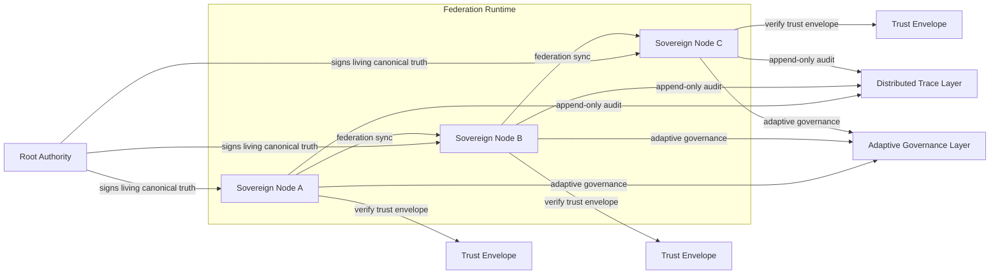

# Z-MOS Gen 4 Requirements Document (RD)

- Document Code: `RD-GEN4-001`
- Version: `0.3`
- Status: Draft
- Baseline: Z-MOS v3.0.1 "Purity"

---

## 1. Vision & Objectives

### 1.1 Proposed Codename

- **Z-MOS v4.0 "Sovereignty"**

### 1.2 Vision Statement

Z-MOS v4.0 "Sovereignty" is a Distributed Sovereign Governance Runtime that preserves Gen 3 Purity invariants while extending execution into a federated domain. Sovereignty must maintain Truth-First decision-making, fail-closed enforcement, explicit human-authorized intent, immutable audit trace, and no hidden authority, even as multiple sovereign nodes collaborate on shared governance.

### 1.3 Living Canonical Truth

Living Canonical Truth is the authoritative governance contract that evolves through controlled, authenticated transitions. It is accepted only when:

- an authorized intent explicitly permits the change,
- trace evidence records the transition path,
- the update is signed by the owning authority,
- truth lineage is preserved across versions,
- history remains immutable, and
- rollback capability exists to restore a prior canonical state when an authorized, auditable reversal is required.

### 1.4 Objectives

1. **Lock in distributed sovereign governance**
   - Prioritize multi-agent federation and explicit authority ownership over adaptive intelligence.
   - Ensure multiple nodes can share a governance surface without relaxing Purity invariants.

2. **Protect the truth contract**
   - Treat canonical truth as a living but tightly controlled artifact.
   - Require explicit authorization and cryptographic assurance for any evolution.

3. **Embed explicit human authority**
   - Every governance change and federated intent must be grounded in human-authorized intent.
   - Adaptive behavior must remain subordinate to explicit intent boundaries.

4. **Preserve auditability and recoverability**
   - Maintain append-only, verifiable traces for all decisions and authority transitions.
   - Ensure the system can recover to a known-good canonical truth state.

5. **Enforce discipline across federation**
   - Federation must be stable, disciplined, and predictable.
   - Adaptive governance is allowed only within strict, predefined guardrails.

---

## 2. Core Principles

The following principles are mandatory and non-negotiable for Z-MOS v4.0 "Sovereignty".

### 2.1 Pure Truth-First Authority

- Governance decisions originate from canonical authority.
- No runtime behavior may depend on hidden or undocumented authority sources.
- Local runtime helpers are advisory only and must never override canonical truth.

### 2.2 Living Truth Evolution Rules

- Canonical truth may evolve only through authorized, attested transitions.
- Each transition must have a signed authority endorsement, trace evidence, and lineage metadata.
- Evolution is allowed only within boundaries explicitly defined by the root authority.

### 2.3 Bounded Adaptive Governance

- Adaptive governance is permitted, but only inside explicit guardrails.
- Any adaptation outside the guardrails must fail closed.
- Adaptive decisions must preserve the same safety guarantees as static governance.

### 2.4 Authority Ownership

- Authority ownership must be explicit, discoverable, and verifiable.
- Root Authority is the ultimate owner of canonical truth; delegated authorities control subsets under explicit delegation rules.
- Ownership metadata must be part of the governance contract and trust envelope.

### 2.5 Zero Hidden Authority

- No hidden authority may influence governance.
- All authority sources, delegations, and approval paths must be visible in the truth model.
- Undisclosed authority relationships are prohibited.

### 2.6 Human-Authorized Evolution

- Any truth evolution must begin with human-authorized intent.
- Automated processes may assist, but they cannot self-authorize privilege escalation or authority changes.
- Authority transitions require explicit human-approved evidence.

### 2.7 Explicit Execution Intent

- Execution is only allowed under an explicit intent card.
- Intent must declare scope, allowed operations, data access, and termination conditions.
- Federated execution requires shared acceptance of intent across participating nodes.

### 2.8 Immutable Audit & Verification

- All trace records are append-only and verifiable.
- Trace integrity is required for federation, truth evolution, and governance validation.
- Auditability must be preserved across local and distributed execution.

### 2.9 Separation of Engine and Project State

- Engine logic is stateless and reusable.
- Project-specific runtime artifacts remain isolated in `.z-mos/` per node.
- Federated coordination is explicit, not implicit.

---

## 3. Gap Analysis

This section uses priority, effort, and risk to compare the current Gen 3 Purity baseline against the Gen 4 Sovereignty target.

### 3.1 Highest-Priority P0 Gap: Multi-Agent Federation + Authority Ownership

- Current Gen 3: Single-node workspace runtime with local `.z-mos/` artifacts.
- Target Gen 4: Federated sovereign nodes with explicit authority ownership and trust envelopes.
- Priority: P0
- Effort: High
- Risk: High

### 3.2 Architecture Gap

| Capability | Gen 3 Purity | Gen 4 Sovereignty | Priority | Effort | Risk |
|---|---|---|---|---|---|
| Runtime topology | Single workspace / single node | Federated sovereign nodes | P0 | High | High |
| Canonical trust distribution | Local canonical file | Shared living canonical truth | P0 | High | High |
| Node trust model | Local authority only | Authority ownership + trust envelope | P0 | High | High |

### 3.3 Governance Gap

| Capability | Gen 3 Purity | Gen 4 Sovereignty | Priority | Effort | Risk |
|---|---|---|---|---|---|
| Enforcement model | Static hard-block / fail-closed | Bounded adaptive governance | P1 | Medium | Medium |
| Policy evolution | Manual/offline updates | Authenticated living truth updates | P0 | High | High |
| Authority metadata | Implicit file ownership | Explicit ownership, delegation, trust envelopes | P0 | High | High |

### 3.4 Functional Gap

| Capability | Gen 3 Purity | Gen 4 Sovereignty | Priority | Effort | Risk |
|---|---|---|---|---|---|
| Runtime federation | None | Node discovery + federation scope | P0 | High | High |
| Intent sharing | Local intent card only | Federated intent acceptance | P1 | Medium | Medium |
| Trace correlation | Single-node JSONL | Distributed trace layer | P0 | High | High |

### 3.5 Operational Gap

| Capability | Gen 3 Purity | Gen 4 Sovereignty | Priority | Effort | Risk |
|---|---|---|---|---|---|
| Bootstrap | `zcl init`, `zcl memory init` | Federated bootstrap + authority onboarding | P0 | High | High |
| Recovery | Local repair commands | Cross-node recovery and canonical resync | P1 | Medium | Medium |
| Observability | Local diagnostics | Federated trust and trace visibility | P1 | Medium | Medium |

### 3.6 Gen 3 Strengths to Leverage

- Existing canonical authority files and intent contract model.
- Current runtime state seed and repair flows in CLI commands.
- Append-only trace model as an audit foundation.
- Explicit separation of canonical truth and runtime/session helpers.

### 3.7 Risk Summary

1. **Federation design**: node discovery and trust negotiation at scale.
2. **Authority ownership**: defining explicit delegation without hidden control.
3. **Adaptive gatekeeping**: ensuring adaptive policy cannot bypass hard-block invariants.
4. **Trace federation**: preserving immutable evidence across nodes.

---

## 4. Functional Requirements

### 4.1 Federation Runtime

- Support a federated runtime of sovereign nodes.
- Each node must have explicit identity and participate in federation membership negotiation.
- Federation scope must be defined, discoverable, and constrained.
- Federation state transitions must be auditable and enforce trust boundaries.

### 4.2 Authority & Intent Management

- Define explicit Authority Ownership metadata for root and delegated authorities.
- Authority metadata must be discoverable and cryptographically verifiable.
- Intent management must support human-authorized intent acceptance across nodes.
- Intent cards must declare operation, data, host, and governance scope for the federation.

### 4.3 Living Truth System

- Implement a Living Canonical Truth system with authorized transitions.
- Truth transitions must require signed authority endorsement and trace evidence.
- The system must preserve lineage, immutable history, and rollback capability.
- Living truth must remain the single source of governance validation across the federation.

### 4.4 Distributed Trace Layer

- Extend trace support to capture cross-node governance events.
- Trace records must be append-only, verifiable, and support federation audit.
- Distributed trace must include authority decisions, intent acceptance, and truth transitions.
- Trace verification must be available for diagnostics and governance validation.

### 4.5 Adaptive Governance (Bounded)

- Adaptive governance may adjust runtime behavior within explicit bounds.
- Any policy adaptation must preserve hard-block invariants.
- No adaptive policy may self-authorize privilege escalation.
- Adaptive decisions must include rationale and evidence in the trace.

---

## 5. Non-Functional Requirements

| Category | Requirement |
|---|---|
| Security | Node identity, authority ownership, and truth transitions must be cryptographically verifiable. |
| Determinism | Governance outcomes must be predictable for identical truth, intent, and federation inputs. |
| Auditability | All authority changes, intent acceptances, and distributed trace events must be auditable. |
| Recoverability | The system must support rollback to prior canonical truth and recovery from federation drift. |
| Scalability | The architecture must support multiple sovereign nodes without exponential coordination overhead. |
| Isolation | Local node state and project artifacts must remain isolated from federation state unless explicitly shared. |
| Integrity | Canonical truth, intent, and trace data must remain tamper-proof and verifiable. |
| Maintainability | Federation and governance models must be understandable, inspectable, and maintainable. |
| Usability | Federation operations and governance controls must be clear and explicit for operators. |

---

## 6. High-Level Architecture Overview

### 6.1 Architecture Summary

Z-MOS v4.0 "Sovereignty" introduces a layered architecture that combines sovereign runtime nodes, explicit authority ownership, living canonical truth, distributed trace, and bounded adaptive governance. The architecture must preserve Gen 3 Purity invariants while enabling federation.

### 6.2 Mermaid Diagram

### 6.3 Component Definitions

- **Sovereign Node**: A runtime participant that enforces canonical authority locally, participates in federation coordination, and maintains isolated `.z-mos/` state.
- **Root Authority**: The highest-level owner of canonical truth. It signs truth transitions and authorizes delegated authorities and federated trust envelopes.
- **Trust Envelope**: A signed metadata construct that expresses authority ownership, delegation rules, accepted authority sources, and federation scope.
- **Federation Runtime**: The coordinated execution environment where sovereign nodes share governance contracts, intents, and trace evidence while preserving local safety.
- **Living Canonical Truth**: The authoritative governance contract that evolves under explicit authorization, trace-backed lineage, immutable history, and rollback capability.
- **Distributed Trace Layer**: The append-only audit layer that records cross-node events, authority decisions, intent acceptance, truth transitions, and adaptive governance actions.
- **Adaptive Governance Layer**: The bounded runtime layer that permits evidence-driven adjustments while preserving hard-block invariants and preventing unauthorized privilege escalation.

### 6.4 Architecture Implications

- Federation must be prioritized over adaptive intelligence: multi-agent trust and authority ownership are the primary foundation.
- Authority must be explicit and visible; hidden authority is unacceptable.
- Adaptive governance must operate within a disciplined envelope and cannot override or bypass hard-block invariants.
- Trace and recovery capabilities are essential for maintaining trust and stability across the federation.

---

## 7. Warnings

- Adaptive governance must never bypass hard-block invariants.
- No adaptive policy may self-authorize privilege escalation.

---

## Notes

This requirements document is intentionally scoped to requirements only. It does not include implementation code or pseudocode.
